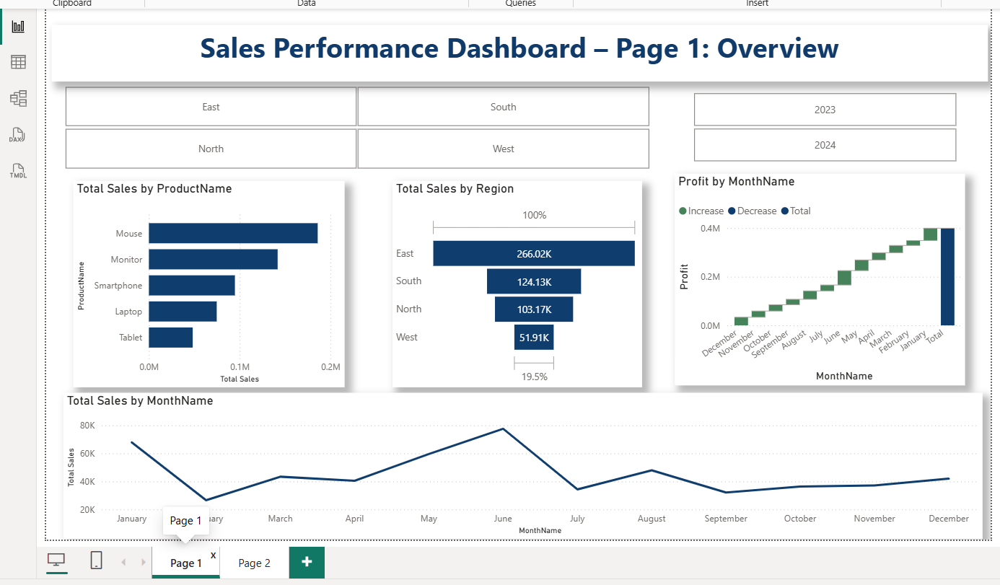
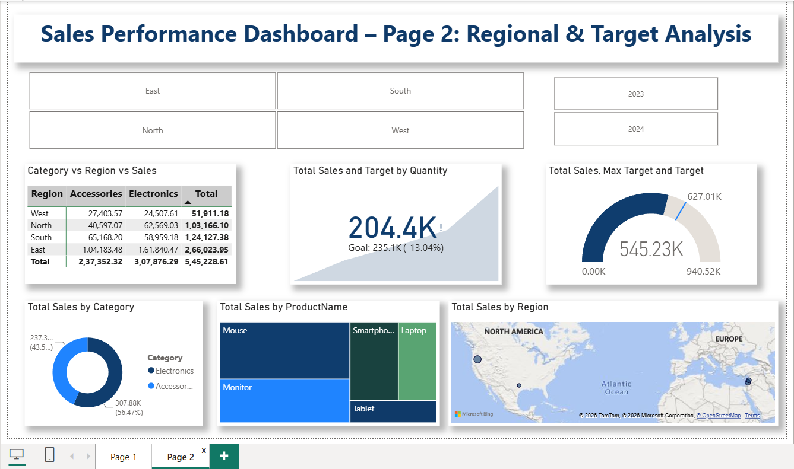

# 📊 E-Commerce Sales Performance Dashboard

## 📌 Project Overview

This project is an interactive Power BI dashboard developed to analyze e-commerce sales performance. The dashboard transforms raw Excel data into meaningful business insights using Power Query, Data Modeling, DAX measures, and interactive visualizations.

---

## 🎯 Objective

To analyze sales performance across different regions, product categories, products, and time periods while tracking business KPIs and identifying sales trends.

---

## 🛠️ Tools & Technologies

- Microsoft Power BI
- Power Query
- DAX (Data Analysis Expressions)
- Microsoft Excel

---

## 📂 Dataset

The dashboard uses an Excel dataset containing:

- Product Details
- Category
- Region
- Sales
- Profit
- Quantity
- Order Date
- Sales Targets

---

## 🔄 Data Preparation

The dataset was transformed using Power Query by:

- Cleaning the data
- Correcting data types
- Removing unnecessary columns
- Creating relationships between tables

---

## 📊 Dashboard Features

### Page 1 – Sales Overview

- Total Sales by Product
- Total Sales by Region
- Monthly Sales Trend
- Monthly Profit Analysis
- Year & Region Filters

### Page 2 – Regional & Target Analysis

- Category vs Region Matrix
- Sales Target KPI
- Total Sales KPI
- Category-wise Sales
- Product-wise Sales
- Regional Sales Map

---

## 📈 Key Insights

- East region recorded the highest sales.
- Electronics generated more sales than Accessories.
- Sales varied across months, showing seasonal trends.
- Interactive filters allow dynamic analysis by year and region.

---

## 📷 Dashboard Preview

### Sales Overview

### Regional & Target Analysis

---

## 📁 Repository Contents

- power_bi_dashboard2.pbix
- Section_3_Modelling_DAX.xlsx
- power_bi_dashboard1.png
- power_bi_dashboard2.png

---

## 💼 Skills Demonstrated

- Data Cleaning
- Data Transformation
- Data Modeling
- DAX
- Data Visualization
- Dashboard Design
- Business Intelligence
- Power BI

---

## 👩‍💻 Author

**Srijani Sinha**

